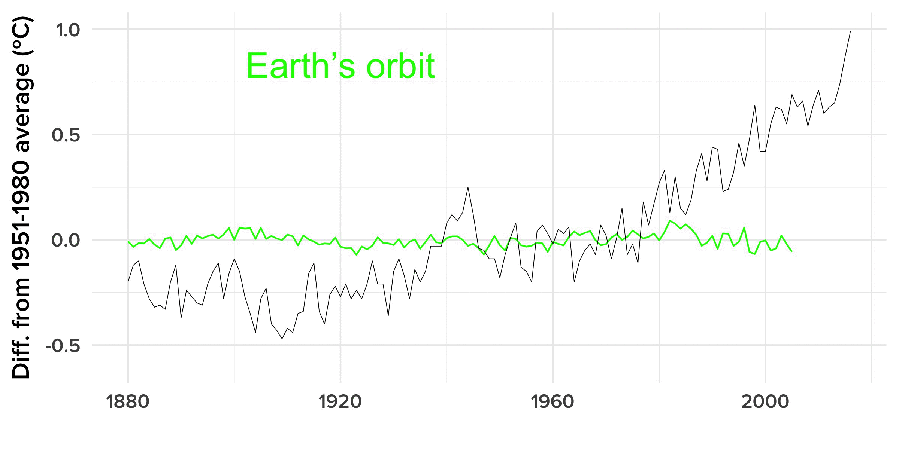
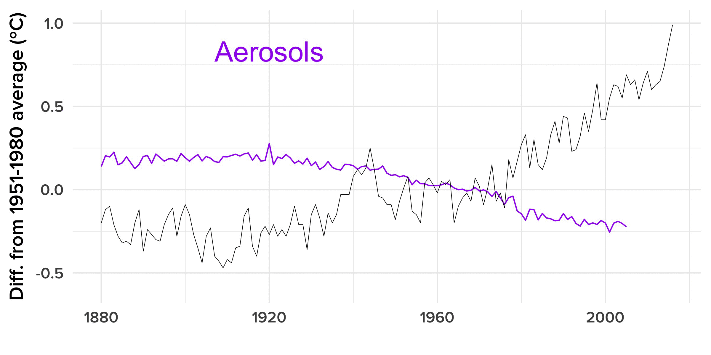

# 2016 Was The Hottest Year. Yes, Greenhouse Gases Are To Blame

```{r knitr_options, include=FALSE}
library(knitr)
opts_chunk$set(out.width="725px", dpi=300)
```


[R](https://www.r-project.org/) code for the analysis supporting [this January 18, 2017 BuzzFeed News article](https://www.buzzfeed.com/peteraldhous/blame-co2-for-record-heat) on the annoucement that 2016 was the warmest year on record. Supporting files are in [this GitHub repository](https://github.com/BuzzFeedNews/2017-01-causes-of-warming).

## Data preparation
The following code loads NASA [data on the average global temperature](https://data.giss.nasa.gov/gistemp/graphs/graph_data/Global_Mean_Estimates_based_on_Land_and_Ocean_Data/graph.csv) for each year since 1880, and [data](https://www.bloomberg.com/graphics/2015-whats-warming-the-world/data/forcings.csv) from NASA climate models, simulating the effects on average annual global temperature of natural (variation in solar radiation, volcanic eruptions, fluctuations in Earth's orbit) and human factors (ozone, pollutant aerosols, greenhouse gases, changes in land use) that can influence climate. This data was previously used by Bloomberg News in 2015 to make [this interactive graphic](https://www.bloomberg.com/graphics/2015-whats-warming-the-world/).

The data from the simulations give estimated global average temperatures in Kelvin (these units have the same magnitude as degrees Celsius). The NASA observed temperature record expresses each year's value as the difference in ºC from the average temperature over the period 1951-1980. So to align the simulations with the historical temperature record, the code below calculates the average estimated annual temperatures for each factor over this period, and then subtracts these average values from the corresponding data.

```{r, results="hide", warning=FALSE, message=FALSE}
# load required library
library(tidyverse)

# load NASA observed historical temperature record data
observed <- read_csv("https://data.giss.nasa.gov/gistemp/graphs/graph_data/Global_Mean_Estimates_based_on_Land_and_Ocean_Data/graph.csv", skip=2) %>%
  select(1,2)
names(observed) <- c("Year","Observed")

# load model simulation data
simulations <- read_csv("https://www.bloomberg.com/graphics/2015-whats-warming-the-world/data/forcings.csv") %>%
  filter(between(Year, 1880, 2005)) %>%
  rename(`Earth’s orbit` = `Orbital changes`,
         Aerosols = `Anthropogenic tropospheric aerosol`,
         `Solar radiation` = Solar)

# calculate average for 1951-1980 baseline from simulations
baseline <- simulations %>%
  filter(between(Year, 1951, 1980)) %>%
  select(2:11) %>%
  summarise_all(mean)

# subtract these values from the simulation data
years <- data_frame(Year = 1880:2005)
years <- cbind(years,baseline)
simulations <- simulations[2:11]-years[2:11] 
simulations <- simulations %>%
  mutate(Year=1880:2005) %>%
  gather(Type, Value, -Year) 

# select combinations of factors for charts

# individual natural factors
natural <- simulations %>%
  filter(grepl("Earth|Solar|Volcanic",Type))

# individual human factors
human <- simulations %>%
  filter(!grepl("Earth|Solar|Volcanic|All|Natural|Human",Type))

# combined natural vs. combined human factors
hum_nat <- simulations %>%
  filter(grepl("Natural|Human",Type))
```

## Charts

To create animations from this code, you will need to install [ImageMagick](http://imagemagick.org/script/index.php).

### Observed historical temperature record

```{r,warning=FALSE, message=FALSE}
ggplot() +
  geom_line(data=observed, aes(x=Year, y=Observed)) +
  theme_minimal(base_size = 16, base_family = "Proxima Nova Semibold") +
  theme(legend.position="top",
        legend.title=element_blank()) +
  scale_y_continuous(limits = c(-0.6,1)) +
  ylab("Diff. from 1951-1980 average (ºC)") +
  xlab("")
```

### Animation of simulated effect of individual natural factors, compared to historical temperature record

```{r, results="hide", warning=FALSE, message=FALSE}

for (t in unique(natural$Type)) {
  tmp <- natural %>%
    filter(Type == t)
  tmp_plot <- ggplot() +
    geom_line(data=tmp, aes(x=Year, y=Value), color ="green") +
    geom_line(data=observed, aes(x=Year, y=Observed), size = 0.2) +
    theme_minimal(base_size = 16, base_family = "Proxima Nova Semibold") +
    theme(legend.position="none",
          legend.title=element_blank()) +
    scale_y_continuous(limits = c(-0.6,1)) +
    annotate("text", x = 1920, y = 0.83, label = t, size = 8, color = "green") +
    ylab("Diff. from 1951-1980 average (ºC)") +
    xlab("")
  ggsave(file=paste0("natural/",t,".jpg"), plot=tmp_plot, width = 8, height = 4, units = "in", dpi=300)
}

# make a GIF with ImageMagick
system("convert -delay 150 natural/*.jpg natural.gif")
```



### Animation of simulated effect of individual natural factors, compared to historical temperature record

```{r, results="hide", warning=FALSE, message=FALSE}
for (t in unique(human$Type)) {
  tmp <- human %>%
    filter(Type == t)
  tmp_plot <- ggplot() +
    geom_line(data=tmp, aes(x=Year, y=Value), color ="purple") +
    geom_line(data=observed, aes(x=Year, y=Observed), size = 0.2) +
    theme_minimal(base_size = 16, base_family = "Proxima Nova Semibold") +
    theme(legend.position="none",
          legend.title=element_blank()) +
    scale_y_continuous(limits = c(-0.6,1)) +
    annotate("text", x = 1920, y = 0.83, label = t, size = 8, color = "purple") +
    ylab("Diff. from 1951-1980 average (ºC)") +
    xlab("")
  ggsave(file=paste0("human/",t,".jpg"), plot=tmp_plot, width = 8, height = 4, units = "in", dpi=300)
}

# make a GIF with ImageMagick
system("convert -delay 150 human/*.jpg human.gif")
```



### Simulated effects of combined human and combined natural factors, compared to historical temperature record

```{r,warning=FALSE, message=FALSE}
ggplot() +
  geom_line(data=hum_nat, aes(x=Year, y=Value, color=Type)) +
  scale_color_manual(values = c("purple","green")) +
  geom_line(data=observed, aes(x=Year, y=Observed), size = 0.2) +
  theme_minimal(base_size = 16, base_family = "Proxima Nova Semibold") +
  theme(legend.position="top",
        legend.title=element_blank()) +
  scale_y_continuous(limits = c(-0.6,1)) +
  ylab("Diff. from 1951-1980 average (ºC)") +
  xlab("")
```

